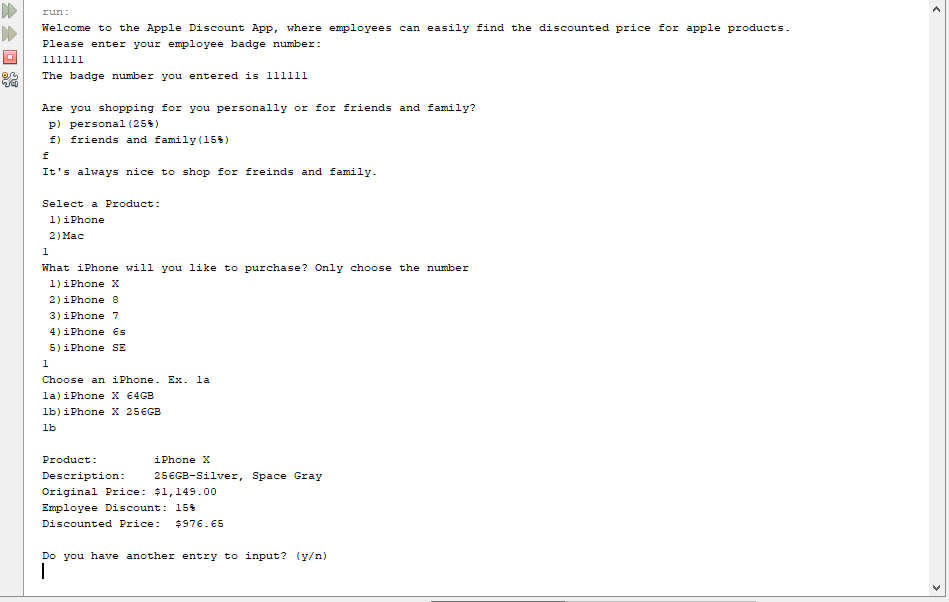
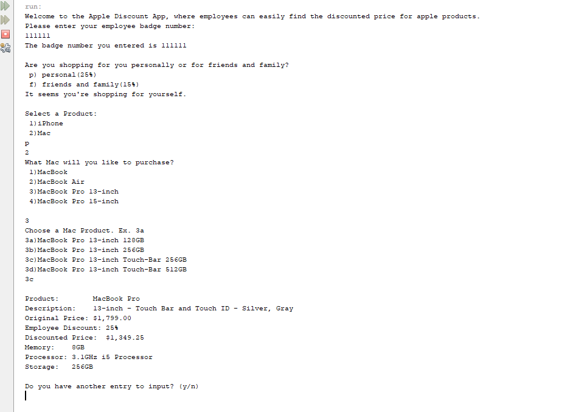

## Project Name:  Apple Employee Discount Application

### Assignment Date:  
June 26, 2018

### Developer Name:  
Andre Weir

### Project Description:
This program allows apple employees to easily determine discounts on Apple Products without having to use EPP site or AppleConnect VPN. 

### Program Layout:
Application is composed of 9 different classes, including a validator class to validate user input and two database classes that stores information for the Mac and iPhone products. The program also uses key object oriented programming fundamentals like inheritance and polymorphism. The layout of the program is as follows:
1. User is asked for employee badge number
2. User is asked who is he/she is shopping for
3. User selects a product: iPhone or Mac
4. User selects what type of product and then the model
5. Program displays the product and model choosen, original price, employee discount, and discounted price

### Screen Shot of Application:

#### Screenshot includes inheritance for the Mac product
